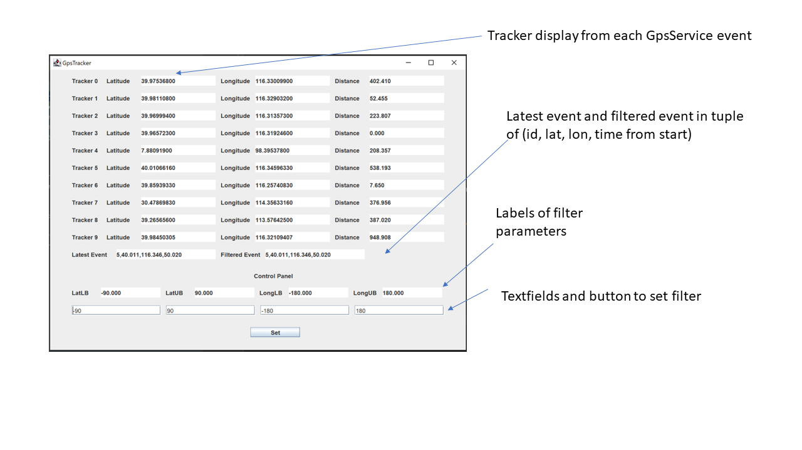

# GpsGUI

A GUI that displays raw and filtered Gps live-feeds (simulated). This application is written
in Java using the `nz.sodium` package under the Functional Reactive Programming framework. 

### Repository Structure

- src - contains core utility classes
  - `GButton/GLabel/GPanel/GTextField` - subclasses of the S-equivalence from the sodium 
  `swidget` package. Add constructors with default `Dimension` for cosmetic convenience.
  - `Pair` - implementation of `Pair` data type from `javafx` package.
  - `Point` - 3D point in Euclidean space - add a static factory method that constructs and
  process Gps data (`latitude,longitude,altitude`). Also add a method to calculate Euclidean distance.
  - `GpsGUI` - basic GUI class with `CellSink<Double> time` and `StreamSink<Unit> sTick` that handles
  timer I/O related aspects. Provides a `runLoop` method with `dT` parameter that fires an `sTick` event
  and updates `time` every `dT` milliseconds. `sTick` is used for managing and transforming time-related events.

- testing - contains files that test ideas
  - `LabelTest` - test the ability to write a GUI using `src.GpsGUI` class. GUI contains a textfield, a label,
  and a button that updates the content of the label based on the current content of the textfield.
  - `FilterTest` - test the ability to set a bound and filter events based on that bound. GUI contains two rows,
  both of which contains a textfield, a label and a button. The `SetBound` button sets a valid upperbound based on
  input from a textfield on the same row. Clicking the `SetNumber` button triggers a stream that carries the current
  value of the textfield on the same row, filtered against the value in the upperbound label. The value label gets 
  updated if the value in the input textfield is not larger than the upperbound. 
  - `TimerSystemTest` - test the ability for the system to handle time. GUI contains a label that displays the 
  elapsed time in seconds counted from when the GUI is opened.
  - `DisappearingLabelTest` - test the ability to automatically clear the textfield after 3 seconds. GUI contains a
  `Set` button that displays "Hello" on a label, which is automatically cleared after 3seconds unless `Set` is clicked 
  again. `sTick` is used to check if 3s has elapsed from the last update, which fires an `Optional<Unit>` stream that
  uses `map` to clear the label. This test corresponds to a feature required in task 2 and 3.
  - `CellContainerTest` - test the ability to automatically store and remove event data in/from a container. Similar to 
  `DisappearingLabelTest`, `sTick` is mapped onto an `Optional<Unit>` stream to remove data outside a running window (5s)
  on current parameter. This stream is `merged` with event stream to update a container.

- `GpsEvent/GpsService/gps.data/Example` - provided classes.
- `GUI/GUIRefactored/GUIFinal` - GUI classes at different development stages.
- `GUITest` - testing of `GUIFinal` using regular-interval known simulated data streams.

